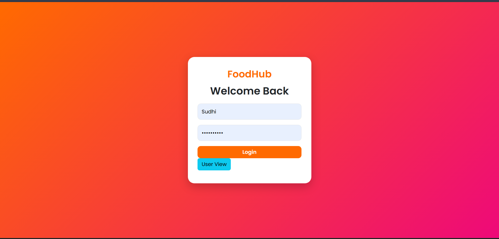
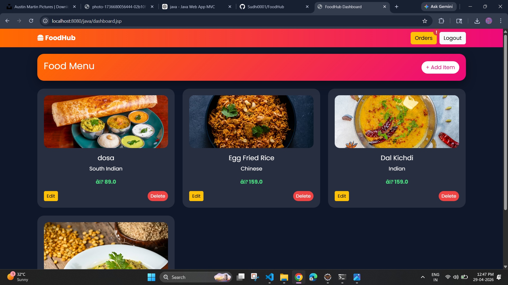
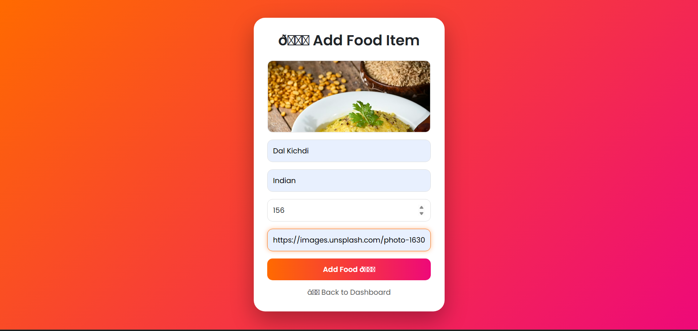
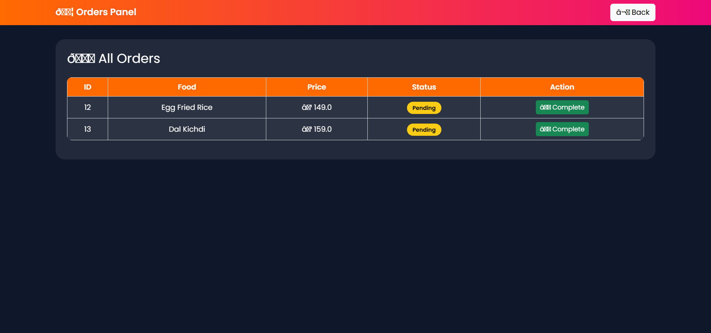

# 🍔 FoodHub – Food Ordering System

A full-stack food ordering web application built using **Java (JSP, Servlets), MySQL, and Bootstrap**.

---

## 🚀 Features

### 👨‍💼 Admin

* Add food items with images
* Edit & delete food
* Manage orders
* Update order status

### 👤 User

* Browse food menu
* View food images
* Place orders

---

## 🛠️ Tech Stack

* **Frontend:** HTML, CSS, Bootstrap
* **Backend:** Java (JSP, Servlets)
* **Database:** MySQL
* **Server:** Apache Tomcat

---

## 📸 Screenshots

### 🔐 Login Page



---

### 📊 Admin Dashboard



---

### ➕ Add Food



---

### 🍽️ User Menu


---

### 📦 Orders Panel



---

## ⚙️ Setup Instructions

1. Clone the repo:

```
git clone https://github.com/Sudhi0001/FoodHub.git
```

2. Import into Eclipse / IntelliJ

3. Configure Tomcat

4. Setup MySQL:

```
CREATE DATABASE foodhub;
```

5. Run project

---

## 🔥 Future Improvements

* Payment integration
* Cart system
* Image upload from device
* Live notifications

---

## 👨‍💻 Author

**Sudhi (Sudheendra G K)**
GitHub: https://github.com/Sudhi0001

---

⭐ If you like this project, give it a star!
